# chlog

[](https://www.npmjs.com/package/@bobfromarcher/chlog)
[](https://github.com/bobfromarcher/chlog/actions/workflows/ci.yml)
[](LICENSE)
[](package.json)

Builds a [Keep a Changelog](https://keepachangelog.com) style `CHANGELOG.md` from your conventional commits and git tags. If you write [Conventional Commits](https://www.conventionalcommits.org), chlog reads the history, groups commits by type, splits them by version using your tags, and links each entry back to its commit. No dependencies, no AI.

<p align="center"></p>

## Install

```bash
npm install -g @bobfromarcher/chlog
# or once:
npx @bobfromarcher/chlog --write
```

## Usage

```bash
chlog [path] [options]
```

| Option | Description |
| --- | --- |
| `--write` | Write `CHANGELOG.md` in the target directory |
| `--unreleased` | Only the commits since your latest tag |
| `--hide-other` | Drop commits that do not follow the conventional format |
| `--json` | Structured JSON for your own templates or release tooling |
| `-h, --help` | Show help |
| `-v, --version` | Show version |

## Examples

```bash
chlog --write              # regenerate the whole CHANGELOG.md
chlog --unreleased         # preview the next release notes
chlog --json | jq '.[0]'   # the latest section as data
```

## What it understands

- Types become headings: `feat` is Features, `fix` is Bug Fixes, plus `perf`, `refactor`, `docs`, `build`, `ci`, `test`, `style`, `chore`, `revert`.
- Scopes: `fix(api): ...` renders with an "api:" prefix.
- Breaking changes: `feat!:` or `feat(x)!:` are collected under a BREAKING CHANGES section.
- Tags: each tag starts a new version section, dated from the tag.
- Commit links are detected from your `origin` remote.

Commits that do not follow the convention are not lost. They land under an "Other" section, or you can drop them with `--hide-other`.

## Development

```bash
git clone https://github.com/bobfromarcher/chlog
cd chlog
node test/test.js
```

CI runs the suite on Node 18, 20 and 22 across Linux, macOS and Windows.

## License

MIT, bobfromarcher.
